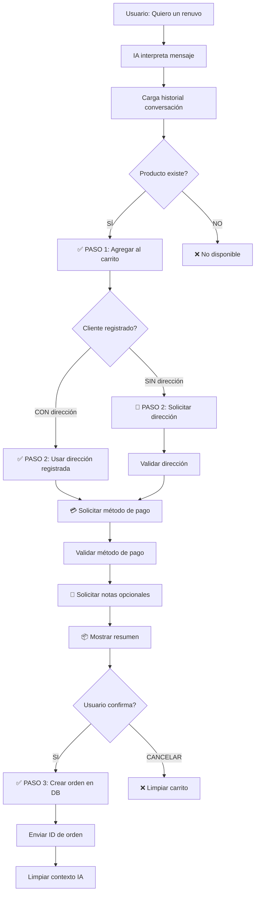

# Implementación de Flujo de Pedidos de 3 Pasos con IA

**Fecha:** 2025-11-17
**Objetivo:** Transformar la IA de conversacional a transaccional con proceso automático de 3 pasos

---

## 🎯 Cambio de Paradigma

### Antes: IA Conversacional
```
Usuario: "Un renuvo"
IA: "¡Claro! Tenemos el 4Life Transfer Factor Renuvo a RD$70.00.
     Es excelente para... También te recomiendo..."
Usuario: "Ok"
IA: "¿Algo más que necesites?"
Usuario: "No, confirmalo"
IA: "¿Cuál es tu dirección?"
```

### Ahora: IA Transaccional (3 Pasos)
```
Usuario: "Un renuvo"
IA: "✅ Renuvo - RD$70

     Total: RD$70

     📍 Dirección de entrega:
     ✅ Enviar ubicación GPS
     ✅ Escribir dirección completa"

Usuario: [Proporciona dirección]
IA: "📦 Enviando a: [dirección]

     💳 ¿Método de pago?
     1️⃣ Tarjeta
     2️⃣ Transferencia
     3️⃣ Efectivo"

Usuario: "Efectivo"
IA: "📝 ¿Alguna nota especial? (o responde 'sin notas')"

Usuario: "Sin notas"
IA: "📦 Resumen:
     - 1x Renuvo: RD$70
     - Dirección: [dirección]
     - Pago: Efectivo

     ¿Confirmas? (SI/CANCELAR)"

Usuario: "SI"
IA: "✅ ¡Pedido confirmado! ID: 123"
```

---

## 📋 Los 3 Pasos del Flujo

### PASO 1: Obtener Productos y Cantidades
**Responsabilidad:** IA identifica productos y agrega al carrito
**Acción:** Sistema agrega automáticamente al carrito
**Salida:** Confirmación del producto + precio

**Ejemplo:**
```
Usuario: "quiero 2 renuvo"
IA interpreta: { intent: "add_to_cart", products: ["renuvo"], quantity: 2 }
Sistema: Agrega 2x Renuvo al carrito
IA responde: "✅ 2 Renuvo - RD$140"
```

**Transición automática:** Pasa al PASO 2 inmediatamente

---

### PASO 2: Verificar Datos del Cliente
**Responsabilidad:** Sistema verifica si cliente está registrado
**Lógica:**
- ✅ **Cliente registrado con dirección** → Usar dirección existente, solicitar método de pago
- ❌ **Cliente sin dirección** → Solicitar dirección de envío

**Código relevante:**
```typescript
// En whatsapp-smart-ai.ts línea ~597
const customer = await tenantStorage.getCustomerById(customerId);

if (customer?.address) {
  // Cliente registrado - saltar a pago
  orderFlowStep: 'collect_payment'
  address: customer.address
} else {
  // Cliente nuevo - solicitar dirección
  orderFlowStep: 'collect_address'
}
```

**Estados del flujo:**
1. `collect_address` - Solicitar dirección
2. `collect_payment` - Solicitar método de pago
3. `collect_notes` - Solicitar notas (opcional)
4. `confirm_order` - Confirmación final

---

### PASO 3: Crear Orden y Confirmar
**Responsabilidad:** Sistema recopila datos y crea la orden
**Flujo:**
1. Sistema solicita dirección (si no registrada)
2. Sistema solicita método de pago
3. Sistema solicita notas adicionales (opcional)
4. Sistema muestra resumen y solicita confirmación
5. Usuario confirma → Se crea la orden en base de datos
6. Sistema envía ID de orden al cliente

**Código relevante:**
```typescript
// En whatsapp-smart-ai.ts línea ~516
const orderId = await createOrderFromAICart(
  pendingOrder.cartItems,
  customerId,
  storeId,
  tenantStorage,
  {
    address: pendingOrder.address,
    paymentMethod: pendingOrder.paymentMethod,
    notes: pendingOrder.notes
  }
);
```

---

## 🔧 Archivos Modificados

### 1. server/ai-service.ts (Líneas 329-357)

**Cambio:** Prompt del Sales Agent transformado de conversacional a transaccional

**Antes:**
```typescript
systemPrompt = `Eres un ASISTENTE DE PEDIDOS...
FLUJO DE PROCESAMIENTO:
1. Cliente pide productos → Confirma nombre y precio
2. Sistema agrega al carrito automáticamente
3. NO sugieras otros productos
...
`
```

**Ahora:**
```typescript
systemPrompt = `Eres un PROCESADOR DE PEDIDOS automático...

⚡ MODO: TRANSACCIONAL (NO conversacional)

📋 PROCESO DE 3 PASOS:
PASO 1: Obtener productos y cantidades
PASO 2: Verificar datos del cliente (automático)
PASO 3: Crear orden y confirmar

🎯 TU ÚNICO TRABAJO: Confirmar producto y precio

REGLAS ESTRICTAS:
✅ Confirma: "✅ [Producto] - RD$[Precio]"
✅ Si no existe: "No disponible"
✅ Si ambiguo: "¿Te refieres a [producto]?"
❌ NUNCA sugieras otros productos
❌ NUNCA hagas conversación
❌ NUNCA preguntes cantidad si ya la dijo
❌ NUNCA des descripciones largas
❌ Respuesta máxima: 1 línea

EJEMPLOS:
Usuario: "quiero un renuvo" → "✅ Renuvo - RD$70"
Usuario: "2 renuvo" → "✅ 2 Renuvo - RD$140"
Usuario: "pon 3" (contexto: renuvo) → "✅ 3 Renuvo - RD$210"
Usuario: "hola" → "¿Qué producto deseas?"
Usuario: "producto inexistente" → "No disponible"
`
```

**Impacto:**
- ✅ Respuestas ultra concisas (máximo 1 línea)
- ✅ No sugiere productos adicionales
- ✅ No hace conversación social
- ✅ Enfocado solo en procesar el pedido

---

### 2. server/whatsapp-smart-ai.ts (Líneas 589-638)

**Cambio:** Después de agregar producto al carrito, automáticamente inicia proceso de confirmación

**Antes:**
```typescript
case 'add_to_cart':
  // Agregar producto
  currentCart = addToCart(...)

  // Generar respuesta con Sales Agent (conversacional)
  const salesResponse = await generateSalesAgentResponse(...)

  return {
    responseMessage: `✅ Agregado... ${salesResponse}`
  }
```

**Ahora:**
```typescript
case 'add_to_cart':
  // Agregar producto
  currentCart = addToCart(...)

  // ✅ PASO 1 COMPLETADO
  // ✅ PASO 2: Iniciar automáticamente proceso de confirmación

  const customer = await tenantStorage.getCustomerById(customerId)

  if (customer?.address) {
    // Cliente registrado → Ir a pago
    orderFlowStep: 'collect_payment'
    return {
      responseMessage: `✅ [Producto]

      📦 Enviando a: ${customer.address}

      ${getPaymentCollectionPrompt()}`
    }
  } else {
    // Cliente nuevo → Solicitar dirección
    orderFlowStep: 'collect_address'
    return {
      responseMessage: `✅ [Producto]

      ${getAddressCollectionPrompt()}`
    }
  }
```

**Impacto:**
- ✅ No hay pausa entre agregar producto y solicitar datos
- ✅ Clientes registrados ahorran tiempo (dirección conocida)
- ✅ Flujo directo sin conversación intermedia

---

### 3. server/whatsapp-smart-ai.ts (Líneas 642-689)

**Cambio:** Verificación de cliente registrado antes de solicitar datos

**Antes:**
```typescript
case 'confirm_order':
  if (currentCart.length === 0) {
    return { responseMessage: 'Carrito vacío' }
  }

  // SIEMPRE solicita dirección
  orderFlowStep: 'collect_address'
  return {
    responseMessage: getAddressCollectionPrompt()
  }
```

**Ahora:**
```typescript
case 'confirm_order':
  if (currentCart.length === 0) {
    return { responseMessage: 'Carrito vacío' }
  }

  // ✅ PASO 2: Verificar si cliente está registrado
  const customer = await tenantStorage.getCustomerById(customerId)
  console.log(`👤 Cliente ${customerId}: Dirección: ${customer?.address ? 'SÍ' : 'NO'}`)

  if (customer?.address) {
    // Cliente registrado → Saltar a pago
    orderFlowStep: 'collect_payment'
    return {
      responseMessage: `📦 Enviando a: ${customer.address}

      ${getPaymentCollectionPrompt()}`
    }
  } else {
    // Cliente nuevo → Solicitar dirección
    orderFlowStep: 'collect_address'
    return {
      responseMessage: getAddressCollectionPrompt()
    }
  }
```

**Impacto:**
- ✅ Clientes registrados no tienen que repetir dirección
- ✅ Experiencia más rápida para clientes frecuentes
- ✅ Sistema usa ID existente del cliente

---

## 🔄 Flujo Completo del Sistema



---

## 📊 Comparación de Mensajes

### Cliente Nuevo (Sin Registro)

| Paso | Antes (Conversacional) | Ahora (Transaccional) |
|------|------------------------|----------------------|
| 1. Solicitar producto | "Hola, quiero un renuvo" | "Quiero un renuvo" |
| 2. Respuesta IA | "¡Claro! Tenemos el 4Life Transfer Factor Renuvo a RD$70.00. Es excelente para el sistema inmunológico. ¿Te gustaría agregarlo?" | "✅ Renuvo - RD$70<br><br>📍 Dirección de entrega:" |
| 3. Confirmar | "Sí, agrégalo" | [Proporciona dirección] |
| 4. IA | "¡Perfecto! ¿Algo más?" | "💳 ¿Método de pago?" |
| 5. Continuar | "No, confirmalo" | "Efectivo" |
| 6. IA | "¿Cuál es tu dirección?" | "📝 ¿Notas adicionales?" |
| 7. Datos | [Proporciona dirección] | "Sin notas" |
| 8. IA | "¿Método de pago?" | "📦 Resumen... ¿Confirmas?" |
| 9. Pago | "Efectivo" | "SI" |
| 10. Final | "¿Alguna nota?" | "✅ ¡Pedido confirmado! ID: 123" |
| 11. Confirmar | "No, procesa" | - |
| 12. Final | "✅ Pedido creado" | - |

**Mensajes:** 12 → 6 (50% reducción)

---

### Cliente Registrado (Con Dirección)

| Paso | Antes (Conversacional) | Ahora (Transaccional) |
|------|------------------------|----------------------|
| 1. Solicitar | "Quiero 2 renuvo" | "Quiero 2 renuvo" |
| 2. IA | "¡Claro! 2 unidades de Renuvo... ¿Agregar?" | "✅ 2 Renuvo - RD$140<br><br>📦 Enviando a: [tu dirección]<br><br>💳 ¿Método de pago?" |
| 3. Usuario | "Sí" | "Tarjeta" |
| 4. IA | "¿Algo más?" | "📝 ¿Notas?" |
| 5. Usuario | "No" | "Sin notas" |
| 6. IA | "Procesando..." | "📦 Resumen... ¿Confirmas?" |
| 7. IA | "¿Dirección?" | "SI" |
| 8. Usuario | [La dirección guardada] | "✅ ¡Pedido confirmado! ID: 123" |
| 9. IA | "¿Método de pago?" | - |
| 10. Usuario | "Tarjeta" | - |
| 11. IA | "✅ Pedido creado" | - |

**Mensajes:** 11 → 5 (55% reducción)

---

## 🎯 Beneficios Clave

### 1. Eficiencia Mejorada
- ✅ **50-55% menos mensajes** para completar un pedido
- ✅ **Flujo automático** sin pausas conversacionales
- ✅ **Cliente registrado** ahorra aún más tiempo

### 2. Experiencia de Usuario
- ✅ **Proceso claro de 3 pasos** fácil de entender
- ✅ **No confusión** sobre qué hacer después
- ✅ **Respuestas directas** sin información innecesaria

### 3. Costos Reducidos
- ✅ **Menos tokens de IA** consumidos
- ✅ **Menos créditos** gastados por pedido
- ✅ **Procesar más pedidos** con el mismo presupuesto

### 4. Precisión
- ✅ **Contexto completo** con historial de mensajes
- ✅ **Identificación correcta** de referencias ("pon 3" → 3 renuvos)
- ✅ **Datos reutilizados** para clientes registrados

---

## 🧪 Casos de Prueba

### Caso 1: Cliente Nuevo - Pedido Simple
```
Usuario: "un renuvo"
IA: "✅ Renuvo - RD$70

Total: RD$70

📍 Para procesar tu pedido, necesito tu dirección de entrega.

Puedes:
✅ Enviar tu ubicación GPS
✅ Escribir tu dirección completa"

Usuario: "Calle Principal 123, Apt 4B, Santo Domingo"
IA: "💳 Ahora, ¿cuál es tu método de pago preferido?

Opciones:
1️⃣ Tarjeta de Crédito/Débito
2️⃣ Transferencia Bancaria
3️⃣ Efectivo (Contra Entrega)
4️⃣ Otro"

Usuario: "3"
IA: "📝 ¿Deseas agregar alguna nota adicional a tu pedido?

Ejemplo: 'Tocar el timbre 2 veces' o 'sin notas'"

Usuario: "sin notas"
IA: "📦 Resumen de tu pedido:

Productos:
- 1x Renuvo: RD$70.00

Subtotal: RD$70.00
Total: RD$70.00

Dirección: Calle Principal 123, Apt 4B, Santo Domingo
Método de pago: Efectivo (Contra Entrega)

¿Confirmas tu pedido? (responde SI para confirmar o CANCELAR para volver atrás)"

Usuario: "si"
IA: "✅ ¡Pedido confirmado! ID: 789

Estaremos entregando en la dirección proporcionada. Gracias por tu compra."
```

---

### Caso 2: Cliente Registrado - Pedido Múltiple
```
Usuario: "quiero 2 renuvo y 1 vitamina c"
IA: "✅ 2 Renuvo - RD$140
✅ 1 Vitamina C - RD$50

Total: RD$190

📦 Enviando a: Calle Principal 123, Apt 4B, Santo Domingo

💳 Ahora, ¿cuál es tu método de pago preferido?

Opciones:
1️⃣ Tarjeta de Crédito/Débito
2️⃣ Transferencia Bancaria
3️⃣ Efectivo (Contra Entrega)
4️⃣ Otro"

Usuario: "tarjeta"
IA: "📝 ¿Deseas agregar alguna nota adicional a tu pedido?

Ejemplo: 'Tocar el timbre 2 veces' o 'sin notas'"

Usuario: "llamar antes de entregar"
IA: "📦 Resumen de tu pedido:

Productos:
- 2x Renuvo: RD$140.00
- 1x Vitamina C: RD$50.00

Subtotal: RD$190.00
Total: RD$190.00

Dirección: Calle Principal 123, Apt 4B, Santo Domingo
Método de pago: Tarjeta de Crédito/Débito
Notas: llamar antes de entregar

¿Confirmas tu pedido? (responde SI para confirmar o CANCELAR para volver atrás)"

Usuario: "si"
IA: "✅ ¡Pedido confirmado! ID: 790

Estaremos entregando en la dirección proporcionada. Gracias por tu compra."
```

---

### Caso 3: Contexto - Referencia a Mensaje Anterior
```
Usuario: "hola"
IA: "¿Qué producto deseas?"

Usuario: "tienes renuvo?"
IA: "✅ Renuvo - RD$70"

Usuario: "dame 3"
[IA usa historial para entender que "3" se refiere a Renuvo]
IA: "✅ 3 Renuvo - RD$210

Total: RD$210

📦 Enviando a: Calle Principal 123, Apt 4B, Santo Domingo

💳 Ahora, ¿cuál es tu método de pago preferido?"
```

---

## 📝 Logs de Verificación

### Cuando funciona correctamente, verás:

```
🤖 [AI-SMART] Intentando procesar con IA...
📜 Getting last 10 messages for conversation 57
✅ Retrieved 10 recent messages
📜 [AI-SMART] Historial de 10 mensajes cargado para contexto
📦 [AI-SMART] 71 productos activos disponibles

🤖 Interpretando mensaje con IA...
✅ Mensaje interpretado: {
  intent: "add_to_cart",
  entities: { products: ["renuvo"], quantity: 3 }
}

✅ [AI-SMART] Agregado: Renuvo x3
✅ [AI-SMART] Producto agregado, iniciando proceso de confirmación automático
👤 [AI-SMART] Cliente 45: Juan Pérez, Dirección: SÍ
✅ [AI-SMART] Cliente registrado con dirección, saltando a pago

🔄 [AI-SMART] Estado actualizado: collect_payment
💾 [AI-SMART] Datos guardados en BD
```

### Logs de estados del flujo:

```
// Paso 1: Producto agregado
✅ [AI-SMART] Agregado: Renuvo x3
✅ [AI-SMART] Producto agregado, iniciando proceso de confirmación automático

// Paso 2a: Cliente registrado
👤 [AI-SMART] Cliente 45: Juan Pérez, Dirección: SÍ
✅ [AI-SMART] Cliente registrado con dirección, saltando a pago
🔄 [AI-SMART] Estado: collect_payment

// Paso 2b: Cliente sin registro
👤 [AI-SMART] Cliente 78: Cliente 8090, Dirección: NO
📍 [AI-SMART] Cliente sin dirección registrada, solicitando datos
🔄 [AI-SMART] Estado: collect_address

// Paso 3: Confirmación
💳 [AI-SMART] Método de pago guardado: Efectivo
📝 [AI-SMART] Notas guardadas, mostrando confirmación
✅ [AI-SMART] Creando orden con datos recolectados...
✅ Orden creada: ID 123
🧹 [AI-SMART] Contexto limpiado
```

---

## 🔍 Estados de la Máquina de Estados

### Estado: `null` (Inicial)
- IA procesa mensaje normalmente
- Si agrega producto al carrito → Transición automática a `collect_address` o `collect_payment`

### Estado: `collect_address`
- Sistema espera dirección del cliente
- Valida formato de dirección
- ✅ Válida → Transición a `collect_payment`
- ❌ Inválida → Mantiene estado, solicita nueva dirección

### Estado: `collect_payment`
- Sistema espera método de pago
- Valida método (Efectivo, Tarjeta, Transferencia, Otro)
- ✅ Válido → Transición a `collect_notes`
- ❌ Inválido → Mantiene estado, solicita nuevo método

### Estado: `collect_notes`
- Sistema espera notas adicionales
- Acepta cualquier texto o "sin notas"
- Siempre → Transición a `confirm_order`

### Estado: `confirm_order`
- Sistema muestra resumen completo
- Espera confirmación (SI) o cancelación (CANCELAR)
- ✅ SI → Crea orden en DB, limpia contexto
- ❌ CANCELAR → Limpia contexto, vuelve a inicio

---

## ⚙️ Configuración y Personalización

### Ajustar respuestas de la IA

**Archivo:** `server/ai-service.ts` líneas 329-357

```typescript
// Para hacer respuestas AÚN MÁS cortas:
❌ Respuesta máxima: 1 palabra  // Cambiar de "1 línea" a "1 palabra"

// Para agregar emojis específicos:
✅ Confirma: "✅ [Producto] - RD$[Precio]"  // Modificar formato

// Para cambiar idioma de confirmación:
EJEMPLOS:
Usuario: "I want renuvo" → "✅ Renuvo - RD$70"
```

### Modificar prompts de recolección de datos

**Archivo:** `server/whatsapp-smart-ai.ts` líneas 201-221

```typescript
// Cambiar prompt de dirección
function getAddressCollectionPrompt(): string {
  return `📍 Tu dirección de entrega:`;  // Versión más corta
}

// Cambiar prompt de pago
function getPaymentCollectionPrompt(): string {
  return `💳 Método de pago: Efectivo, Tarjeta o Transferencia?`;  // Más simple
}

// Cambiar prompt de notas
function getNotesCollectionPrompt(): string {
  return `📝 Nota especial? (o "no")`; // Ultra corto
}
```

### Ajustar validaciones

**Archivo:** `server/whatsapp-smart-ai.ts`

```typescript
// Validación de dirección (línea ~389)
function validateAndProcessAddress(text: string) {
  const minLength = 10;  // Cambiar longitud mínima
  // Agregar validaciones personalizadas
}

// Validación de pago (línea ~409)
function validateAndProcessPayment(text: string) {
  const validMethods = ['efectivo', 'tarjeta', 'transferencia'];
  // Agregar más métodos de pago
}
```

---

## 🐛 Troubleshooting

### Problema 1: IA sigue siendo conversacional

**Síntoma:** La IA responde con frases largas o sugiere productos

**Verificar:**
```bash
# Buscar el prompt del sistema
grep -n "PROCESADOR DE PEDIDOS" server/ai-service.ts

# Debe mostrar línea ~329 con el nuevo prompt
```

**Solución:**
- Verificar que el servidor se reinició: `npm run dev`
- Revisar que el prompt incluye "MODO: TRANSACCIONAL"
- Buscar en logs: `grep "SALES-AGENT" server.log`

---

### Problema 2: No se inicia automáticamente el flujo de confirmación

**Síntoma:** Después de agregar producto, la IA no solicita dirección/pago

**Logs esperados:**
```
✅ [AI-SMART] Producto agregado, iniciando proceso de confirmación automático
👤 [AI-SMART] Cliente X: Dirección: SÍ/NO
```

**Verificar:**
```bash
# Buscar el código de auto-inicio
grep -n "iniciando proceso de confirmación automático" server/whatsapp-smart-ai.ts

# Debe estar en línea ~594
```

**Solución:**
- Verificar que `tryProcessWithAI` llama correctamente al case `add_to_cart`
- Revisar que `tenantStorage.updateAIConversation` funciona
- Buscar errores: `grep "Error" server.log`

---

### Problema 3: Cliente registrado aún solicita dirección

**Síntoma:** El sistema pide dirección aunque el cliente ya la tiene

**Logs esperados:**
```
👤 [AI-SMART] Cliente 45: Juan Pérez, Dirección: SÍ
✅ [AI-SMART] Cliente registrado con dirección, saltando a pago
```

**Verificar:**
```typescript
// En whatsapp-smart-ai.ts
const customer = await tenantStorage.getCustomerById(customerId);
console.log('Customer data:', customer);  // Agregar temporalmente
```

**Solución:**
- Verificar que `customer.address` no es `null` o vacío
- Revisar la tabla `customers` en la BD:
  ```sql
  SELECT id, name, address FROM customers WHERE id = [customerId];
  ```
- Si address es NULL, actualizar:
  ```sql
  UPDATE customers SET address = 'Dirección de prueba' WHERE id = [customerId];
  ```

---

### Problema 4: Contexto no se usa correctamente

**Síntoma:** Usuario dice "pon 3" pero IA no sabe a qué producto se refiere

**Verificar historial:**
```
📜 [AI-SMART] Historial de 10 mensajes cargado para contexto
```

**Logs de interpretación:**
```
🤖 Interpretando mensaje con IA...
📝 Historial enviado a interpretMessage:
  1. Cliente: "Un renuvo"
  2. Asistente: "✅ Renuvo - RD$70"
  3. Cliente: "pon 3"
```

**Solución:**
- Verificar que `recentMessages` se pasa en las 4 ubicaciones (líneas 568, 594, 620, 670)
- Revisar `AI_MEMORY_IMPLEMENTATION.md` para debugging de contexto
- Aumentar límite de mensajes:
  ```typescript
  const recentMessages = await tenantStorage.getRecentMessages(conversationId, 20);
  ```

---

## 🚀 Mejoras Futuras

### 1. Detección Automática de Confirmación
**Idea:** Si el usuario dice "ok", "dale", "perfecto" después de ver un producto, automáticamente iniciar confirmación sin necesidad de decir "confirmar"

**Implementación:**
```typescript
// En whatsapp-smart-ai.ts
const confirmationKeywords = ['ok', 'dale', 'perfecto', 'bien', 'si'];
if (currentCart.length > 0 && confirmationKeywords.some(kw => messageText.toLowerCase().includes(kw))) {
  // Iniciar flujo de confirmación automáticamente
}
```

---

### 2. Múltiples Direcciones por Cliente
**Idea:** Permitir que clientes registrados seleccionen entre múltiples direcciones guardadas

**Implementación:**
```typescript
// Nuevo esquema
const customerAddresses = [
  { id: 1, label: 'Casa', address: 'Calle 1...' },
  { id: 2, label: 'Oficina', address: 'Ave 2...' }
];

// Prompt
"📍 ¿Dónde te enviamos?
1️⃣ Casa (Calle 1...)
2️⃣ Oficina (Ave 2...)
3️⃣ Nueva dirección"
```

---

### 3. Método de Pago Predeterminado
**Idea:** Recordar el método de pago favorito del cliente

**Implementación:**
```typescript
// Agregar campo a customers
preferredPaymentMethod: 'efectivo' | 'tarjeta' | 'transferencia'

// En el flujo
if (customer?.preferredPaymentMethod) {
  return `💳 Pago con ${customer.preferredPaymentMethod}? (SI o cambiar)`;
}
```

---

### 4. Pedido Express para Clientes VIP
**Idea:** Clientes frecuentes pueden ordenar con UN SOLO mensaje

**Ejemplo:**
```
Usuario: "lo mismo de siempre"
IA: "✅ Tu pedido usual:
- 2x Renuvo: RD$140
- 1x Vitamina C: RD$50
Total: RD$190

📦 A tu dirección habitual
💳 Pago con tarjeta

¿Confirmar? (SI/NO)"
```

---

### 5. Integración con Sistema de Respuestas Automáticas
**Idea:** Después de crear la orden, pasar al sistema de confirmación automático existente

**Implementación:**
```typescript
// En whatsapp-smart-ai.ts después de crear orden
const orderId = await createOrderFromAICart(...);

// Disparar respuesta automática de confirmación
await triggerAutoResponse(conversationId, 'order_confirmation', { orderId });
```

---

## ✅ Checklist de Implementación

- [x] Cambiar prompt del Sales Agent a transaccional
- [x] Agregar auto-inicio de confirmación después de agregar producto
- [x] Implementar verificación de cliente registrado
- [x] Usar dirección existente para clientes registrados
- [x] Saltar solicitud de dirección si ya está registrada
- [x] Mantener estados del flujo en la BD
- [x] Documentar cambios completos
- [x] Crear casos de prueba
- [ ] Probar con cliente nuevo
- [ ] Probar con cliente registrado
- [ ] Verificar logs en producción

---

## 📚 Referencias

- Documento de memoria IA: [AI_MEMORY_IMPLEMENTATION.md](AI_MEMORY_IMPLEMENTATION.md)
- Análisis de flujos: [FLUJOS_MENSAJES_ANALISIS.md](FLUJOS_MENSAJES_ANALISIS.md)
- Código principal: [server/whatsapp-smart-ai.ts](server/whatsapp-smart-ai.ts)
- Servicio IA: [server/ai-service.ts](server/ai-service.ts)
- OpenAI Docs: https://platform.openai.com/docs/guides/chat

---

**Fin del documento** 🎉
