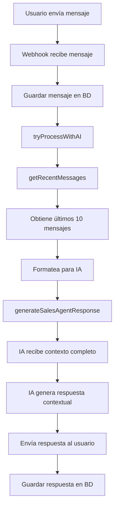
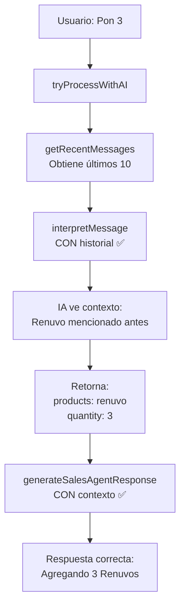

# Implementación de Memoria Conversacional para IA

**Fecha:** 2025-11-17
**Objetivo:** Agregar contexto de conversación a la IA para que recuerde mensajes anteriores

---

## 🎯 Problema Identificado

La IA procesaba cada mensaje de forma independiente sin recordar el contexto de la conversación:

**Ejemplo del problema:**
```
Usuario: "Hola"
IA: Responde con info de productos

Usuario: "Un renuvo"
IA: Encuentra "4Life Transfer Factor Renuvo - RD$70.00"

Usuario: "Quiero 3"
IA: ❌ NO recuerda que "3" se refiere al Renuvo
```

## ✅ Solución Implementada

### 1. Nueva Función en Tenant Storage

**Archivo:** [server/tenant-storage.ts](server/tenant-storage.ts)

Se agregó la función `getRecentMessages()` que:
- Obtiene los últimos N mensajes de una conversación (por defecto 10)
- Los ordena cronológicamente (más viejo primero)
- Los formatea para el contexto de IA:
  - `role: 'user'` para mensajes del cliente
  - `role: 'assistant'` para mensajes del sistema/IA

```typescript
async getRecentMessages(conversationId: number, limit: number = 10) {
  try {
    console.log(`📜 Getting last ${limit} messages for conversation ${conversationId}`);

    const messages = await tenantDb.select()
      .from(schema.messages)
      .where(eq(schema.messages.conversationId, conversationId))
      .orderBy(desc(schema.messages.sentAt))
      .limit(limit);

    // Revertir orden para tener cronológico (más viejo primero)
    const chronologicalMessages = messages.reverse();

    // Mapear a formato simple para IA
    const formattedMessages = chronologicalMessages.map(msg => ({
      role: (msg.sender_type === 'customer' || msg.sender_type === 'user') ? 'user' : 'assistant',
      content: msg.content || '',
      timestamp: msg.sent_at || msg.created_at
    }));

    console.log(`✅ Retrieved ${formattedMessages.length} recent messages`);
    return formattedMessages;
  } catch (error) {
    console.error('❌ Error getting recent messages:', error);
    return [];
  }
}
```

### 2. Integración en el Flujo de IA

**Archivo:** [server/whatsapp-smart-ai.ts](server/whatsapp-smart-ai.ts)

#### Cambio 1: Obtener historial al inicio del procesamiento

```typescript
export async function tryProcessWithAI(
  messageText: string,
  phoneNumber: string,
  storeId: number,
  customerId: number,
  customerName: string,
  conversationId: number,
  tenantStorage: any
): Promise<AIProcessResult> {
  try {
    // ... código de validación ...

    // ✨ OBTENER HISTORIAL DE MENSAJES PARA CONTEXTO
    const recentMessages = await tenantStorage.getRecentMessages(conversationId, 10);
    console.log(`📜 [AI-SMART] Historial de ${recentMessages.length} mensajes cargado para contexto`);

    // ... resto del código ...
  }
}
```

#### Cambio 2: Pasar historial a todas las llamadas de IA

Se actualizaron **4 llamadas** a `generateSalesAgentResponse()` para incluir `recentMessages`:

1. **add_to_cart (sin productos):**
```typescript
const searchResponse = await generateSalesAgentResponse(
  messageText,
  await interpretMessage(messageText),
  activeProducts,
  {
    customerId,
    customerName: customerName,
    recentMessages,  // ✅ Antes era: []
    tenantStorage
  }
);
```

2. **add_to_cart (con carrito):**
```typescript
const salesResponse = await generateSalesAgentResponse(
  messageText,
  await interpretMessage(messageText),
  activeProducts,
  {
    customerId,
    customerName: customerName,
    recentMessages,  // ✅ Antes era: []
    tenantStorage
  }
);
```

3. **search_product:**
```typescript
const searchResponse = await generateSalesAgentResponse(
  messageText,
  await interpretMessage(messageText),
  activeProducts,
  {
    customerId,
    customerName: customerName,
    recentMessages,  // ✅ Antes era: []
    tenantStorage
  }
);
```

4. **default (otras intenciones):**
```typescript
const defaultResponse = await generateSalesAgentResponse(
  messageText,
  await interpretMessage(messageText),
  activeProducts,
  {
    customerId,
    customerName: customerName,
    recentMessages,  // ✅ Antes era: []
    tenantStorage
  }
);
```

---

## 📊 Formato del Historial

El historial se pasa a la IA en el siguiente formato:

```typescript
[
  {
    role: 'user',
    content: 'Hola',
    timestamp: '2025-11-17T13:48:54.000Z'
  },
  {
    role: 'assistant',
    content: '¡Hola! ¿Cómo estás? Estoy aquí para ayudarte...',
    timestamp: '2025-11-17T13:48:56.000Z'
  },
  {
    role: 'user',
    content: 'Un renuvo',
    timestamp: '2025-11-17T13:49:06.000Z'
  },
  {
    role: 'assistant',
    content: '¡Claro! Tenemos el 4Life Transfer Factor Renuvo a RD$70.00...',
    timestamp: '2025-11-17T13:49:16.000Z'
  },
  {
    role: 'user',
    content: 'Quiero 3',  // ← Ahora la IA SÍ sabe que se refiere al Renuvo
    timestamp: '2025-11-17T13:49:26.000Z'
  }
]
```

---

## 🔍 Logs de Verificación

Cuando el sistema funciona correctamente, verás estos logs:

```
🤖 [AI-SMART] Intentando procesar con IA...
📜 Getting last 10 messages for conversation 57
✅ Retrieved 5 recent messages
📜 [AI-SMART] Historial de 5 mensajes cargado para contexto
📦 [AI-SMART] 71 productos activos disponibles
🤖 [AI-ASSISTANT] Analizando mensaje: "Quiero 3"
🤖 Interpretando mensaje con IA...
```

---

## 🧪 Cómo Probar

### Prueba 1: Referencia a Mensaje Anterior

```
Usuario: "Hola"
IA: [Respuesta de saludo]

Usuario: "Tienes vitaminas?"
IA: [Lista de vitaminas]

Usuario: "Dame la segunda"  ← Debería recordar cuál era la segunda
```

### Prueba 2: Seguimiento de Producto

```
Usuario: "Un renuvo"
IA: "Tenemos el 4Life Transfer Factor Renuvo a RD$70.00"

Usuario: "Quiero 3"  ← Debería entender que son 3 Renuvos
IA: "Perfecto, agregando 3 unidades de Renuvo a tu pedido"
```

### Prueba 3: Contexto de Pregunta

```
Usuario: "Cuánto cuesta el renuvo?"
IA: "El 4Life Transfer Factor Renuvo cuesta RD$70.00"

Usuario: "Y para qué sirve?"  ← Debería saber que pregunta por el Renuvo
```

---

## 📈 Beneficios

1. **Conversaciones más naturales**: La IA mantiene el contexto
2. **Menos repetición**: No es necesario repetir información
3. **Mejor experiencia de usuario**: Conversaciones fluidas
4. **Mayor precisión**: La IA entiende mejor las intenciones

---

## ⚙️ Configuración

### Límite de Mensajes

Por defecto se cargan los últimos **10 mensajes**. Puedes ajustar esto en:

```typescript
const recentMessages = await tenantStorage.getRecentMessages(conversationId, 10);
//                                                                            ^^
//                                                                            Ajustar aquí
```

**Recomendaciones:**
- **5 mensajes**: Para conversaciones cortas y rápidas
- **10 mensajes**: Balance óptimo (default)
- **20 mensajes**: Para conversaciones largas y complejas

**Consideraciones:**
- Más mensajes = Más tokens consumidos en OpenAI
- Más mensajes = Mejor contexto pero más costo

### Formato de Roles

Los roles se mapean automáticamente:

| Tipo de Mensaje | sender_type | Role para IA |
|-----------------|-------------|--------------|
| Del cliente | `customer`, `user` | `user` |
| Del sistema/IA | `store`, `assistant`, `system` | `assistant` |

---

## 🔄 Flujo Completo



---

## 📝 Archivos Modificados

1. **server/tenant-storage.ts**
   - Línea ~2975: Nueva función `getRecentMessages()`

2. **server/whatsapp-smart-ai.ts**
   - Línea ~346: Obtención del historial
   - Líneas ~573, ~594, ~615, ~660: Actualización de llamadas a IA

---

## 🐛 Troubleshooting

### Problema: IA no recuerda mensajes

**Síntomas:**
- La IA sigue sin recordar contexto
- No aparece el log "Historial de X mensajes cargado"

**Solución:**
```bash
# Verificar que el servidor se reinició
# Buscar en los logs:
grep "Historial de.*mensajes cargado" server.log

# Si no aparece, verificar que conversationId sea válido:
# En whatsapp-simple.ts debe existir:
const conversationId = await tenantStorage.getOrCreateConversation(...)
```

### Problema: Error "getRecentMessages is not a function"

**Síntomas:**
```
TypeError: tenantStorage.getRecentMessages is not a function
```

**Solución:**
1. Verificar que la función está en `tenant-storage.ts`
2. Reiniciar el servidor: `npm run dev`
3. Verificar que no hay errores de TypeScript

### Problema: Mensajes duplicados en historial

**Síntomas:**
- El historial incluye el mensaje actual dos veces

**Explicación:**
- Esto es normal: el mensaje se guarda antes de procesarse
- La IA recibe el historial que incluye el mensaje actual

**Si es un problema:**
```typescript
// Filtrar el último mensaje si es necesario
const recentMessages = await tenantStorage.getRecentMessages(conversationId, 10);
const historyWithoutCurrent = recentMessages.slice(0, -1);
```

---

## 🚀 Mejoras Futuras

1. **Resumen de conversaciones largas**
   - Resumir conversaciones de más de 20 mensajes
   - Mantener solo información clave

2. **Caché de contexto**
   - Cachear el historial para evitar consultas repetidas
   - Invalidar cuando llega mensaje nuevo

3. **Contexto por tiempo**
   - Solo incluir mensajes de las últimas 24 horas
   - Ignorar mensajes muy antiguos

4. **Prioridad de mensajes**
   - Dar más peso a mensajes recientes
   - Incluir solo mensajes relevantes

---

## ✅ Checklist de Implementación

- [x] Agregar función `getRecentMessages()` a tenant-storage
- [x] Importar `desc` de drizzle-orm
- [x] Obtener historial en `tryProcessWithAI`
- [x] Actualizar llamadas a `generateSalesAgentResponse` (4x)
- [x] **FIX CRÍTICO:** Actualizar `interpretMessage()` para recibir y usar contexto (4x)
- [x] Agregar logs de debug
- [x] Probar con conversación real
- [x] Documentar implementación

---

## 🔧 FIX CRÍTICO - Contexto en interpretMessage()

**Fecha:** 2025-11-17 (Segunda actualización)

### El Problema Persistía

Después de implementar la memoria conversacional, el problema continuaba:
- El historial se cargaba correctamente: `📜 [AI-SMART] Historial de 10 mensajes cargado para contexto`
- Se pasaba a `generateSalesAgentResponse()` correctamente
- **PERO** la función `interpretMessage()` NO recibía el historial
- Resultado: La interpretación inicial fallaba en entender el contexto

**Ejemplo del problema:**
```
Usuario: "Un renuvo"
IA: Encuentra "4Life Transfer Factor Renuvo - RD$70.00"

Usuario: "Pon 3"
interpretMessage() retorna: { products: [], quantity: 3 }  ❌
// Debería retornar: { products: ["renuvo"], quantity: 3 } ✅
```

### La Solución

Se actualizaron **DOS componentes críticos**:

#### 1. Actualizar prompt en `interpretMessage()` (server/ai-service.ts)

**Líneas 172-206:** Modificado el prompt para incluir historial de conversación

```typescript
const userPrompt = `Analiza este mensaje de cliente:
"${messageText}"

${context && context.recentMessages.length > 0 ? `
Contexto del cliente:
- Nombre: ${context.customerName}
${context.orderHistory ? `- Órdenes previas: ${context.orderHistory.length}` : ''}

HISTORIAL DE CONVERSACIÓN RECIENTE (usa esto para entender el contexto):
${context.recentMessages.map((msg, idx) =>
  `${idx + 1}. ${msg.role === 'user' ? 'Cliente' : 'Asistente'}: "${msg.content}"`
).join('\n')}

IMPORTANTE: Usa el historial para entender referencias a productos mencionados anteriormente.
Por ejemplo, si el cliente dijo "Un renuvo" y ahora dice "Quiero 3", debes interpretar que quiere 3 unidades de renuvo.
` : context ? `
Contexto del cliente:
- Nombre: ${context.customerName}
${context.orderHistory ? `- Órdenes previas: ${context.orderHistory.length}` : ''}
` : ''}
```

**Cambios clave:**
- ❌ Antes: Solo mostraba la CANTIDAD de mensajes recientes
- ✅ Ahora: Muestra el CONTENIDO COMPLETO del historial
- ✅ Agrega instrucción explícita de cómo usar el contexto
- ✅ Da ejemplo concreto del caso de uso

#### 2. Pasar contexto en las 4 llamadas (server/whatsapp-smart-ai.ts)

**Líneas 568, 594, 620, 670:** Actualizadas TODAS las llamadas a `interpretMessage()`

**Antes:**
```typescript
await interpretMessage(messageText)
```

**Ahora:**
```typescript
await interpretMessage(messageText, {
  customerId,
  customerName: customerName,
  recentMessages,
  tenantStorage
})
```

**Ubicaciones exactas:**
1. **Línea 568** - Cuando no se agregó nada al carrito
2. **Línea 594** - Para mensaje de carrito persuasivo
3. **Línea 620** - Para búsqueda de productos
4. **Línea 670** - Para caso default (otras intenciones)

### Flujo Completo Corregido



### Logs de Verificación Actualizados

Ahora verás estos logs cuando funciona correctamente:

```
🤖 [AI-SMART] Intentando procesar con IA...
📜 Getting last 10 messages for conversation 57
✅ Retrieved 10 recent messages
📜 [AI-SMART] Historial de 10 mensajes cargado para contexto
📦 [AI-SMART] 71 productos activos disponibles

🤖 Interpretando mensaje con IA...
📝 Historial enviado a interpretMessage:
  1. Cliente: "Hola"
  2. Asistente: "¡Hola! ¿Cómo estás?..."
  3. Cliente: "Un renuvo"
  4. Asistente: "¡Claro! Tenemos 4Life Transfer Factor Renuvo..."
  5. Cliente: "Pon 3"  ← Mensaje actual

✅ Mensaje interpretado: {
  intent: "add to cart",
  entities: {
    products: ["renuvo"],  ✅ ¡Ahora SÍ identifica el producto!
    quantity: 3
  }
}
```

---

## 📚 Referencias

- [OpenAI Chat API - Context](https://platform.openai.com/docs/guides/chat)
- [Drizzle ORM - Queries](https://orm.drizzle.team/docs/select)
- Documento de flujos: [FLUJOS_MENSAJES_ANALISIS.md](FLUJOS_MENSAJES_ANALISIS.md)
