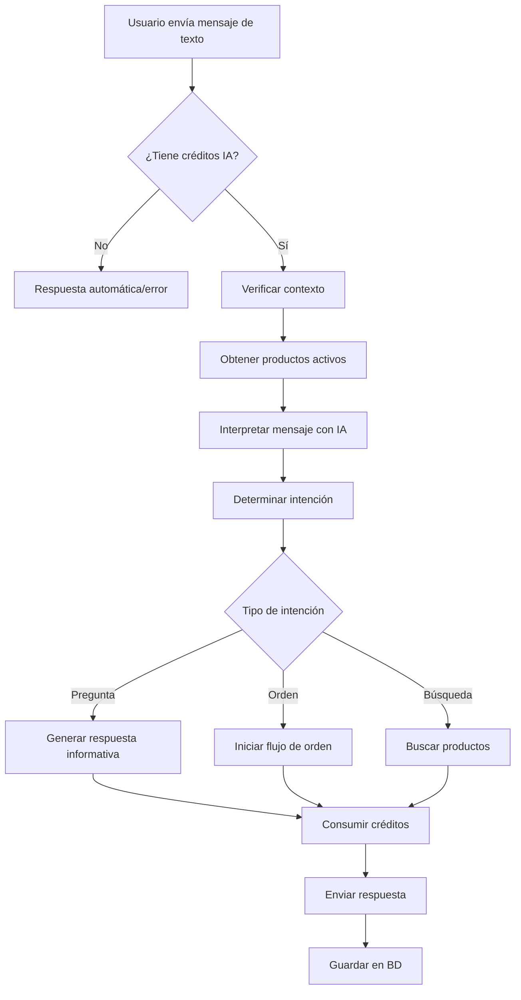
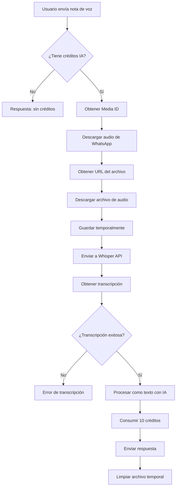

# Análisis de Flujos de Mensajes - Sistema WhatsApp

**Fecha:** 2025-11-17
**Objetivo:** Documentar los tres flujos principales de procesamiento de mensajes

---

## 📋 Resumen Ejecutivo

El sistema procesa mensajes de WhatsApp en tres flujos principales:

1. **Mensajes Automáticos**: Respuestas predefinidas (bienvenida, catálogo, ayuda)
2. **Mensajes con IA de Texto**: Procesamiento inteligente con OpenAI GPT
3. **Notas de Voz con IA**: Transcripción con Whisper + procesamiento con GPT

---

## 🔄 Flujo 1: Mensajes Automáticos

### Descripción
Respuestas predefinidas que se envían automáticamente según el contexto del usuario.

### Tipos de Respuestas Automáticas

#### 1.1 Mensaje de Bienvenida
**Trigger:** Primera interacción del usuario o comando "hola"

**Proceso:**
```
Usuario envía mensaje → Sistema detecta primera interacción
→ Envía bienvenida con botones → Marca contexto: isAfterWelcome=true
```

**Botones Enviados:**
- 🛍️ Ver Productos (`show_products`)
- ❓ Ayuda (`help`)
- 📞 Contactar (`contact`)

#### 1.2 Catálogo de Productos
**Trigger:** Usuario presiona botón "Ver Productos" o envía "show_products"

**Proceso:**
```
Usuario solicita catálogo → Sistema obtiene productos activos
→ Formatea lista de productos → Envía catálogo
→ Marca contexto: isAfterCatalog=true
```

**Formato del Catálogo:**
```
📦 Catálogo de Productos

1. Producto A - RD$XX.XX
   Descripción breve

2. Producto B - RD$XX.XX
   Descripción breve

...

Para ordenar, escribe el número del producto
```

#### 1.3 Mensaje de Ayuda
**Trigger:** Usuario presiona botón "Ayuda" o envía "help"

**Proceso:**
```
Usuario solicita ayuda → Envía instrucciones de uso
→ Marca contexto: isHelpMode=true
```

### Variables de Contexto

| Variable | Tipo | Descripción |
|----------|------|-------------|
| `isAfterWelcome` | boolean | Usuario recibió mensaje de bienvenida |
| `isAfterCatalog` | boolean | Usuario recibió catálogo de productos |
| `lastAutoResponse` | string | Último mensaje automático enviado |
| `isHelpMode` | boolean | Usuario solicitó ayuda |

### Código Relevante
- Archivo: `server/whatsapp-simple.ts`
- Líneas: ~1900-2100
- Función: `processWhatsAppMessage()`

---

## 🤖 Flujo 2: Mensajes de Texto con IA

### Descripción
Procesamiento inteligente de mensajes de texto usando OpenAI GPT para interpretar intenciones y generar respuestas contextuales.

### Proceso Completo



### Paso 1: Verificación de Créditos

**Logs:**
```
🔍 [AI-CREDITS] Verificando créditos para tienda 6
💰 [AI-CREDITS] Tienda 6 - Op: message, Costo: 1, Disponibles: 952
✅ [AI-CREDITS] Créditos SUFICIENTES - Activar IA
```

**Código:**
```typescript
const hasCredits = await checkAICredits(storeId, 'message', tenantStorage);
if (!hasCredits) {
  return { shouldUseAI: false, reason: 'insufficient_credits' };
}
```

### Paso 2: Contexto del Mensaje

**Logs:**
```
📋 [AI-SMART] Contexto actual: {
  isAfterWelcome: true,
  isAfterCatalog: false,
  lastAutoResponse: 'welcome'
}
```

**Código:**
```typescript
const context = {
  isAfterWelcome: true,
  isAfterCatalog: false,
  lastAutoResponse: 'welcome'
};
```

### Paso 3: Obtención de Productos

**Logs:**
```
📦 [AI-SMART] 71 productos activos disponibles
📦 [SALES-AGENT] Listado de productos:
  1. *Akwä Kit Sistema de la Piel - RD$17.00 (VITAMINAS)
  2. 4Life Transfer Factor AgePro - RD$73.00 (VITAMINAS)
  ...
```

### Paso 4: Interpretación con IA

**Primer paso - Interpretación:**
```
🤖 [AI-ASSISTANT] Analizando mensaje: "show_products"
🤖 Interpretando mensaje con IA...
```

**Resultado de interpretación:**
```json
{
  "intent": "show products",
  "category": "question",
  "entities": {
    "products": [],
    "quantity": 0,
    "location": "",
    "phoneNumber": ""
  },
  "sentiment": "neutral",
  "suggestedResponse": "Claro, aquí tienes nuestros productos disponibles...",
  "confidence": 0.85
}
```

### Paso 5: Mapeo de Intención

**Logs:**
```
🧠 [AI-SMART] Interpretación IA: {
  intent: 'ask_question',
  itemsCount: 0,
  message: 'Claro, aquí tienes nuestros productos...'
}
```

**Mapeo de Intenciones:**

| Intent OpenAI | Intent Sistema | Acción |
|---------------|----------------|--------|
| `show products` | `ask_question` | Mostrar catálogo |
| `order` | `search_product` | Buscar producto específico |
| `inquiry` | `ask_question` | Responder pregunta |
| `greeting` | `greeting` | Saludar |

### Paso 6: Generación de Respuesta

**Logs:**
```
🤖 [SALES-AGENT] Generando respuesta de vendedor con datos REALES...
📊 [SALES-AGENT] Productos disponibles en catálogo: 71
📤 [SALES-AGENT] ENVIANDO A OPENAI:
  Productos que se envían: *Akwä Kit Sistema..., 4Life Transfer...
  Modo: VENDEDOR (con productos)
  Prompt resumido: Cliente dice: "show_products"
```

**Respuesta Generada:**
```
¡Hola! Estoy aquí para ayudarte a conocer algunos de nuestros productos increíbles.

1. **Akwä Kit Sistema de la Piel** - RD$17.00: Este sistema incluye...

2. **4Life Transfer Factor AgePro** - RD$73.00: Este suplemento apoya...

3. **Prezoom La Bestia en Polvo** - RD$74.00: Perfecto para antes...

Si alguno de estos productos te interesa, házmelo saber...
```

### Paso 7: Consumo de Créditos

**Logs:**
```
✅ [MASTER-STORAGE] Créditos encontrados para tienda 6
♻️ Using cached tenant storage for store 6
🧾 [AI-CREDITS] Log registrado en tenant store_6
✅ [AI-CREDITS] Consumidos 1 créditos. Restantes: 952
```

### Paso 8: Envío y Guardado

**Logs:**
```
📤 SENDING WHATSAPP MESSAGE - To: 18494553242, Store: 6
✅ MESSAGE SENT SUCCESSFULLY
✅ WhatsApp log saved successfully with store ID: 6
✅ Added WhatsApp log: outbound for 18494553242
```

### Costos de Créditos

| Operación | Costo | Descripción |
|-----------|-------|-------------|
| Mensaje de texto | 1 crédito | Interpretación + respuesta |
| Orden completa | 5 créditos | Procesamiento de pedido |
| Nota de voz | 10 créditos | Transcripción + interpretación |

### Archivos Clave

1. **whatsapp-smart-ai.ts** - Lógica principal del flujo IA
2. **ai-service.ts** - Comunicación con OpenAI
3. **ai-credits-manager.ts** - Gestión de créditos
4. **tenant-storage.ts** - Almacenamiento por tienda

---

## 🎙️ Flujo 3: Notas de Voz con Transcripción

### Descripción
Procesamiento de mensajes de voz usando Whisper API de OpenAI para transcripción, seguido de procesamiento con GPT.

### Proceso Completo



### Detección de Nota de Voz

**Código:**
```typescript
const messageType = message.type || 'text';

if (messageType === 'audio') {
  console.log(`🎙️ VOICE NOTE RECEIVED - From: ${customerPhone}`);
  // Iniciar proceso de transcripción
}
```

### Paso 1: Obtención de Credenciales

```typescript
// Obtener configuración de WhatsApp
const whatsappConfig = await masterStorage.getWhatsAppConfig(storeId);
const openaiApiKey = process.env.OPENAI_API_KEY;

if (!whatsappConfig || !openaiApiKey) {
  messageText = '[VOICE_NOTE_ERROR]';
  return;
}
```

### Paso 2: Creación del Transcriptor

```typescript
const { createAudioTranscriber } = await import('./audio-transcriber.js');
const transcriber = createAudioTranscriber(
  whatsappConfig.accessToken,
  openaiApiKey
);
```

### Paso 3: Obtención del Media ID

**Logs esperados:**
```
🎙️ Downloading audio from WhatsApp - Media ID: {mediaId}
🔍 Fetching media URL from: https://graph.facebook.com/v18.0/{mediaId}/
```

**Código:**
```typescript
const audioMediaId = message.audio?.id;
const audioMimeType = message.audio?.mime_type || 'audio/ogg';

if (!audioMediaId) {
  console.error('❌ No audio media ID found in message');
  messageText = '[VOICE_NOTE_ERROR]';
  return;
}
```

### Paso 4: Descarga del Audio

**API de WhatsApp:**
```
GET https://graph.facebook.com/v18.0/{media_id}
Authorization: Bearer {access_token}

Response:
{
  "url": "https://lookaside.fbsbx.com/whatsapp_business/...",
  "mime_type": "audio/ogg; codecs=opus",
  "sha256": "...",
  "file_size": 12345,
  "id": "{media_id}"
}
```

**Logs esperados:**
```
✅ Got media URL from WhatsApp: https://lookaside.fbsbx.com...
📦 Media response data: { url: "...", mime_type: "audio/ogg", ... }
✅ Audio downloaded successfully - Size: 12345 bytes
```

### Paso 5: Transcripción con Whisper

**Proceso:**
```typescript
// Guardar buffer a archivo temporal
const tempFilePath = path.join(tempDir, `audio-${Date.now()}.ogg`);
fs.writeFileSync(tempFilePath, audioBuffer);

// Crear FormData
const formData = new FormData();
formData.append('file', fs.createReadStream(tempFilePath), filename);
formData.append('model', 'whisper-1');
formData.append('language', 'es'); // Español

// Enviar a Whisper API
const response = await fetch('https://api.openai.com/v1/audio/transcriptions', {
  method: 'POST',
  headers: { Authorization: `Bearer ${openaiApiKey}` },
  body: formData
});
```

**Logs esperados:**
```
🎤 Transcribing audio using Whisper API...
📁 Audio saved to temporary file: /temp-audio/audio-1234567890.ogg
📤 Sending audio to Whisper API (12345 bytes, format: ogg)
📥 Whisper API response status: 200
✅ Audio transcribed successfully
📝 Transcription: "Hola, quiero hacer un pedido de tres productos..."
```

### Paso 6: Procesamiento de Transcripción

**Código:**
```typescript
const transcriptionResult = await transcriber.downloadAndTranscribe(
  audioMediaId,
  audioMimeType
);

if (transcriptionResult.success && transcriptionResult.transcription) {
  messageText = transcriptionResult.transcription;
  console.log(`✅ VOICE NOTE TRANSCRIBED: "${messageText}"`);
} else {
  console.error(`❌ TRANSCRIPTION FAILED: ${transcriptionResult.error}`);
  messageText = '[VOICE_NOTE_ERROR]';
}
```

### Paso 7: Guardado en Base de Datos

**Logs esperados:**
```
💾 GUARDANDO MENSAJE EN BASE DE DATOS...
📝 GUARDANDO MENSAJE: "Hola, quiero hacer..." de 18494553242
✅ MENSAJE GUARDADO EXITOSAMENTE:
   - DB ID: 1024
   - Conversación: 57
   - WhatsApp ID: wamid.HBgL...
```

**Código:**
```typescript
const processedContent = messageType === 'audio' ? messageText : undefined;
const saveResult = await ensureConversationAndSaveMessage(
  message,
  storeId,
  tenantStorage,
  processedContent // ← Transcripción guardada aquí
);
```

### Paso 8: Procesamiento con IA

Una vez transcrito, el texto se procesa igual que un mensaje de texto normal (ver Flujo 2).

### Paso 9: Consumo de Créditos

**Costo:** 10 créditos (más costoso que mensaje de texto)

```
✅ [AI-CREDITS] Consumidos 10 créditos. Restantes: 942
```

### Paso 10: Limpieza

```typescript
// Limpiar archivo temporal
if (tempFilePath && fs.existsSync(tempFilePath)) {
  fs.unlinkSync(tempFilePath);
  console.log(`🗑️ Temporary audio file cleaned up`);
}
```

### Manejo de Errores

**Errores Comunes:**

1. **Sin Media ID:**
```
❌ No audio media ID found in message
→ messageText = '[VOICE_NOTE_ERROR]'
```

2. **Error al descargar:**
```
❌ Error downloading audio from WhatsApp: [error details]
❌ Error details: Failed to get media URL: 404 Not Found
```

3. **Error en Whisper API:**
```
❌ Whisper API error: 401 - Invalid API key
❌ Whisper API failed: 401 Unauthorized
```

4. **Sin créditos:**
```
⚠️ [AI-CREDITS] Créditos INSUFICIENTES - No usar IA
→ Respuesta automática sin transcripción
```

### Formatos de Audio Soportados

| Formato | MIME Type | Extensión |
|---------|-----------|-----------|
| OGG (default WhatsApp) | `audio/ogg` | `.ogg` |
| MP3 | `audio/mpeg` | `.mp3` |
| MP4 | `audio/mp4` | `.mp4` |
| WAV | `audio/wav` | `.wav` |
| WebM | `audio/webm` | `.webm` |
| AAC | `audio/aac` | `.aac` |

### Archivos Clave

1. **audio-transcriber.ts** - Servicio de transcripción
2. **whatsapp-simple.ts:1949-1999** - Detección y proceso de audio
3. **ai-credits-manager.ts** - Gestión de costos

---

## 🔧 Configuración Necesaria

### Variables de Entorno

```env
# OpenAI (requerido para IA y transcripción)
OPENAI_API_KEY=sk-proj-...

# WhatsApp Business API
META_APP_ID=711755744667781
META_APP_SECRET=02297143a30d59ac45d8be64c62a318f
WEBHOOK_VERIFY_TOKEN=verifytoken12345
VERIFY_TOKEN=verifytoken12345

# Base de datos
DATABASE_URL=postgresql://...
```

### Configuración por Tienda

Cada tienda debe tener:

1. **Configuración de WhatsApp:**
   - Access Token
   - Phone Number ID
   - Business Account ID

2. **Créditos de IA:**
   - Total de créditos
   - Créditos disponibles
   - Costos configurados
   - Auto-recarga (opcional)

---

## 📊 Comparativa de Flujos

| Característica | Automático | IA Texto | IA Voz |
|----------------|------------|----------|--------|
| **Costo** | 0 créditos | 1 crédito | 10 créditos |
| **Tiempo respuesta** | <1s | 2-5s | 5-10s |
| **Requiere OpenAI** | No | Sí | Sí |
| **Personalización** | Baja | Alta | Alta |
| **Complejidad** | Baja | Media | Alta |
| **Casos de uso** | Bienvenida, ayuda | Preguntas, órdenes | Mensajes de voz |

---

## 🐛 Problemas Corregidos (Sesión Actual)

### 1. Webhook URL Incorrecta
**Problema:** URL sin prefijo `/api`
**Solución:** Usar `https://domain.com/api/webhook`

### 2. Variable de Entorno Incorrecta
**Problema:** `VERIFY_TOKEN` vs `WEBHOOK_VERIFY_TOKEN`
**Solución:** Soportar ambas en el código

### 3. API de WhatsApp Incorrecta
**Problema:** Usando `graph.instagram.com`
**Solución:** Cambiar a `graph.facebook.com`

### 4. Falta de Logging
**Problema:** Difícil debuggear errores de transcripción
**Solución:** Agregar logs detallados en cada paso

---

## ✅ Verificación del Sistema

### Checklist de Funcionamiento

**Mensajes Automáticos:**
- [ ] Bienvenida se envía al primer mensaje
- [ ] Botones interactivos funcionan
- [ ] Catálogo se muestra correctamente
- [ ] Ayuda se envía cuando se solicita

**IA de Texto:**
- [ ] Créditos se verifican antes de usar IA
- [ ] Interpretación funciona correctamente
- [ ] Respuestas son contextuales
- [ ] Créditos se consumen correctamente
- [ ] Logs se registran en BD

**Notas de Voz:**
- [ ] Audio se descarga de WhatsApp
- [ ] Transcripción se realiza correctamente
- [ ] Texto transcrito se procesa con IA
- [ ] Créditos (10) se consumen
- [ ] Archivos temporales se limpian

### Comandos de Prueba

**1. Probar mensaje automático:**
```bash
curl -X POST http://localhost:5000/api/webhook \
  -H "Content-Type: application/json" \
  -d '{
    "entry": [{
      "changes": [{
        "value": {
          "messages": [{
            "from": "1234567890",
            "type": "text",
            "text": { "body": "hola" }
          }]
        }
      }]
    }]
  }'
```

**2. Verificar créditos:**
```sql
SELECT * FROM ai_credits WHERE store_id = 6;
```

**3. Ver logs de WhatsApp:**
```sql
SELECT * FROM whatsapp_logs
WHERE store_id = 6
ORDER BY created_at DESC
LIMIT 10;
```

---

## 📚 Referencias

- [WhatsApp Business API Docs](https://developers.facebook.com/docs/whatsapp)
- [OpenAI Whisper API](https://platform.openai.com/docs/guides/speech-to-text)
- [OpenAI GPT API](https://platform.openai.com/docs/guides/text-generation)
